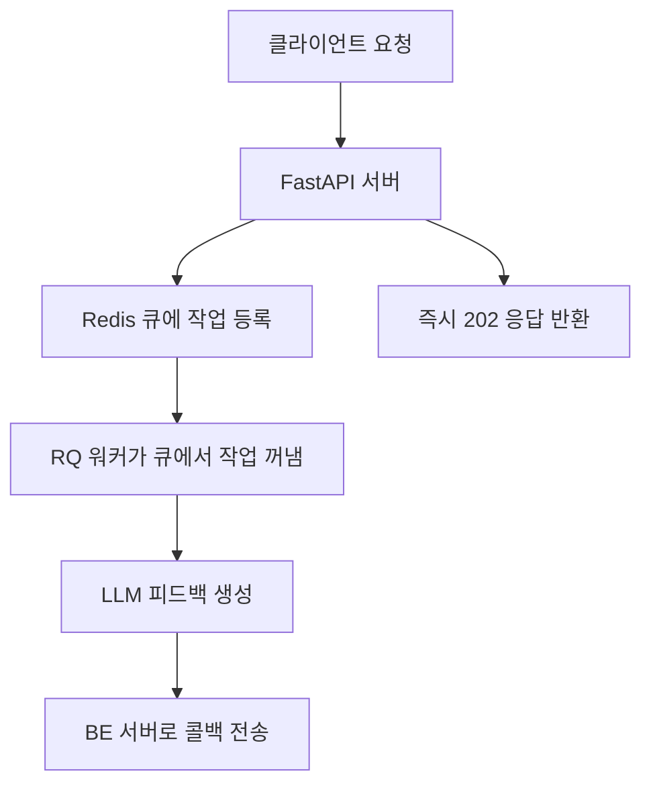

# Feedback Router Changes 

# 2024-06-15

## 주요 변경사항

### 1. 날짜 처리 개선
- `Submission` 모델에 `submittedAt` 필드의 커스텀 밸리데이터 추가
- 배열 형식의 날짜 데이터 처리 지원 ([year, month, day, hour, minute, second, microsecond])
- 마이크로초가 999999를 초과하는 경우 자동 조정

### 2. `GroupChallenge` 모델 개선
- `startDate`와 `endDate` 필드에 커스텀 밸리데이터 추가
- 배열 형식의 날짜 데이터 처리 지원 ([year, month, day, hour, minute, second])

### 3. 백엔드 통신 개선
- 콜백 URL 수정: `https://springboot.dev-leafresh.app/api/members/feedback/result`
- 콜백 요청 시 인증 헤더 추가
- URL 중복 슬래시(//) 제거

### 4. 에러 처리 강화
- 상세한 에러 로깅 추가
- HTTP 상태 코드별 적절한 에러 메시지 반환
- 백엔드 통신 실패 시 상세한 에러 정보 로깅

### 5. 응답 형식 표준화
- 모든 응답에 status, message, data 필드 포함
- 202 Accepted 응답 추가 (비동기 처리 시작 시)
- 400 Bad Request 응답 개선 (유효성 검사 실패 시)

## 기술적 세부사항

### 날짜 처리 로직
```python
@field_validator('submittedAt', mode='before')
@classmethod
def parse_submitted_at(cls, v):
    if isinstance(v, list):
        if len(v) == 7:
            microsecond = min(v[6], 999999)
            return datetime(v[0], v[1], v[2], v[3], v[4], v[5], microsecond)
        return datetime(*v)
    return v
```

### 백엔드 통신 로직
```python
callback_url = f"https://springboot.dev-leafresh.app/api/members/feedback/result"
callback_payload = {
    "memberId": data.get("memberId"),
    "content": feedback_result.get("data", {}).get("feedback", "")
}
```

## 테스트 방법
1. 날짜 형식 테스트:
   - 배열 형식: `[2024, 6, 15, 12, 0, 0, 0]`
   - ISO 문자열 형식: `"2024-06-15T12:00:00Z"`

2. 백엔드 통신 테스트:
   - 피드백 생성 요청
   - 콜백 응답 확인
   - 에러 케이스 처리 확인

# 2025-06-26

## 주요 변경사항: Redis 큐 기반 비동기 피드백 생성 전환

### 1. Redis 큐(RQ) 기반 비동기 처리 도입
- FastAPI 서버에서 피드백 생성 요청을 받으면, 동기/백그라운드 처리 대신 **Redis 큐(feedback)**에 작업을 등록하도록 변경
- 별도의 **RQ 워커**가 Redis 큐에서 작업을 꺼내 LLM 피드백 생성 및 콜백 전송을 담당
- 서버 확장성, 장애 복구, 대량 트래픽 대응력 향상

### 2. 코드 구조 요약
- `feedback_router.py`에서 요청을 받으면 `feedback_queue.enqueue(generate_feedback_task, data)`로 큐에 등록
- `tasks.py`의 `generate_feedback_task` 함수가 실제 LLM 피드백 생성 및 콜백 전송을 담당
- RQ 워커는 별도 프로세스(`rq worker feedback`)로 실행




### 3. Redis 서버 관리법
#### Redis 서버 켜는 법
- Ubuntu 기준:
  ```bash
  sudo service redis-server start
  # 또는
  redis-server
  ```
- Docker 사용 시:
  ```bash
  docker run -d --name redis-queue -p 6379:6379 redis:latest
  ```

#### Redis 서버 끄는 법
- Ubuntu 기준:
  ```bash
  sudo service redis-server stop
  ```
- Docker 사용 시:
  ```bash
  docker stop redis-queue
  docker rm redis-queue
  ```

#### Redis 서버 상태 확인
```bash
redis-cli ping
# → PONG 이 나오면 정상 동작
```

### 4. RQ 워커 실행/중지
- 워커 실행:
  ```bash
  rq worker feedback
  ```
- 워커는 여러 개 띄울 수 있음(동시 처리량 증가)
- 워커 중지는 Ctrl+C 또는 프로세스 종료

### 5. 전체 구조 요약
- FastAPI 서버: 요청을 Redis 큐에 등록 → 즉시 202 응답 반환
- RQ 워커: 큐에서 작업을 꺼내 LLM 피드백 생성 및 콜백 전송
- Redis 서버: 큐 역할, AI 서버와 워커가 함께 사용

### 6. 테스트 및 운영 팁
- Redis, 워커, FastAPI 서버가 모두 실행 중이어야 정상 동작
- 장애 복구, 확장성, 분산 처리에 유리
- 운영 환경에서는 Redis 보안 설정, 모니터링, 백업 등 추가 고려 필요