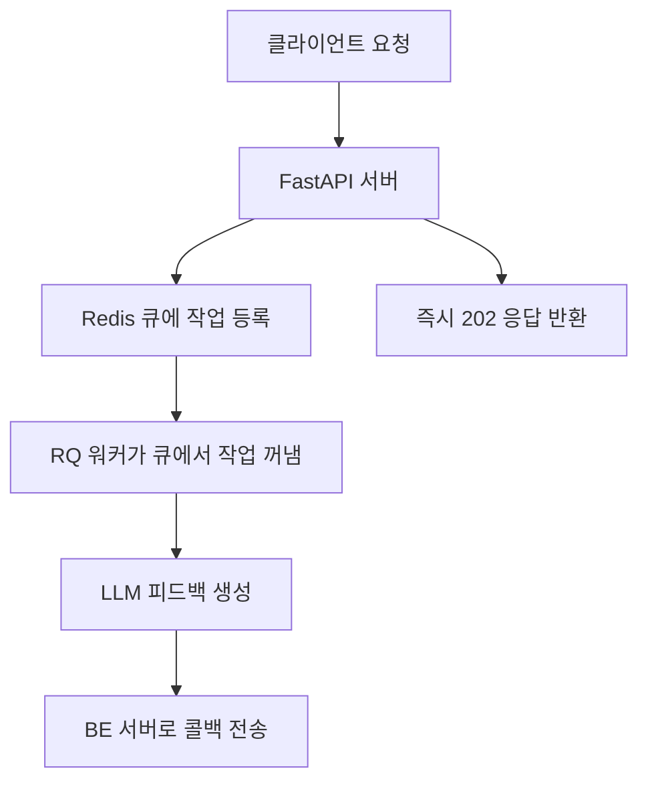
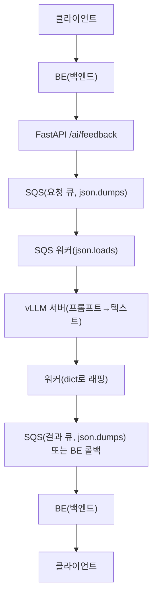

# Feedback Router Changes 

# 2024-06-15

## 주요 변경사항

### 1. 날짜 처리 개선
- `Submission` 모델에 `submittedAt` 필드의 커스텀 밸리데이터 추가
- 배열 형식의 날짜 데이터 처리 지원 ([year, month, day, hour, minute, second, microsecond])
- 마이크로초가 999999를 초과하는 경우 자동 조정

### 2. `GroupChallenge` 모델 개선
- `startDate`와 `endDate` 필드에 커스텀 밸리데이터 추가
- 배열 형식의 날짜 데이터 처리 지원 ([year, month, day, hour, minute, second])

### 3. 백엔드 통신 개선
- 콜백 URL 수정: `https://springboot.dev-leafresh.app/api/members/feedback/result`
- 콜백 요청 시 인증 헤더 추가
- URL 중복 슬래시(//) 제거

### 4. 에러 처리 강화
- 상세한 에러 로깅 추가
- HTTP 상태 코드별 적절한 에러 메시지 반환
- 백엔드 통신 실패 시 상세한 에러 정보 로깅

### 5. 응답 형식 표준화
- 모든 응답에 status, message, data 필드 포함
- 202 Accepted 응답 추가 (비동기 처리 시작 시)
- 400 Bad Request 응답 개선 (유효성 검사 실패 시)

## 기술적 세부사항

### 날짜 처리 로직
```python
@field_validator('submittedAt', mode='before')
@classmethod
def parse_submitted_at(cls, v):
    if isinstance(v, list):
        if len(v) == 7:
            microsecond = min(v[6], 999999)
            return datetime(v[0], v[1], v[2], v[3], v[4], v[5], microsecond)
        return datetime(*v)
    return v
```

### 백엔드 통신 로직
```python
callback_url = f"https://springboot.dev-leafresh.app/api/members/feedback/result"
callback_payload = {
    "memberId": data.get("memberId"),
    "content": feedback_result.get("data", {}).get("feedback", "")
}
```

## 테스트 방법
1. 날짜 형식 테스트:
   - 배열 형식: `[2024, 6, 15, 12, 0, 0, 0]`
   - ISO 문자열 형식: `"2024-06-15T12:00:00Z"`

2. 백엔드 통신 테스트:
   - 피드백 생성 요청
   - 콜백 응답 확인
   - 에러 케이스 처리 확인

# 2025-06-26

## 주요 변경사항: Redis 큐 기반 비동기 피드백 생성 전환

### 1. Redis 큐(RQ) 기반 비동기 처리 도입
- FastAPI 서버에서 피드백 생성 요청을 받으면, 동기/백그라운드 처리 대신 **Redis 큐(feedback)**에 작업을 등록하도록 변경
- 별도의 **RQ 워커**가 Redis 큐에서 작업을 꺼내 LLM 피드백 생성 및 콜백 전송을 담당
- 서버 확장성, 장애 복구, 대량 트래픽 대응력 향상

### 2. 코드 구조 요약
- `feedback_router.py`에서 요청을 받으면 `feedback_queue.enqueue(generate_feedback_task, data)`로 큐에 등록
- `tasks.py`의 `generate_feedback_task` 함수가 실제 LLM 피드백 생성 및 콜백 전송을 담당
- RQ 워커는 별도 프로세스(`rq worker feedback`)로 실행




### 3. Redis 서버 관리법
#### Redis 서버 켜는 법
- Ubuntu 기준:
  ```bash
  sudo service redis-server start
  # 또는
  redis-server
  ```
- Docker 사용 시:
  ```bash
  docker run -d --name redis-queue -p 6379:6379 redis:latest
  ```

#### Redis 서버 끄는 법
- Ubuntu 기준:
  ```bash
  sudo service redis-server stop
  ```
- Docker 사용 시:
  ```bash
  docker stop redis-queue
  docker rm redis-queue
  ```

#### Redis 서버 상태 확인
```bash
redis-cli ping
# → PONG 이 나오면 정상 동작
```

### 4. RQ 워커 실행/중지
- 워커 실행:
  ```bash
  rq worker feedback
  ```
- 워커는 여러 개 띄울 수 있음(동시 처리량 증가)
- 워커 중지는 Ctrl+C 또는 프로세스 종료

### 5. 전체 구조 요약
- FastAPI 서버: 요청을 Redis 큐에 등록 → 즉시 202 응답 반환
- RQ 워커: 큐에서 작업을 꺼내 LLM 피드백 생성 및 콜백 전송
- Redis 서버: 큐 역할, AI 서버와 워커가 함께 사용

### 6. 테스트 및 운영 팁
- Redis, 워커, FastAPI 서버가 모두 실행 중이어야 정상 동작
- 장애 복구, 확장성, 분산 처리에 유리
- 운영 환경에서는 Redis 보안 설정, 모니터링, 백업 등 추가 고려 필요

# 2025-06-29

## 주요 변경사항: 통합 모델 아키텍처 최적화

### 1. 모델 서비스 분리 제거 및 통합 구조 채택
- 기존에 제안했던 별도 모델 서비스(`model_service.py`) 제거
- **shared_model** 싱글톤 패턴을 통한 통합 모델 관리 구조 채택
- FastAPI 서버 시작 시 4비트 양자화된 Mistral 모델이 메모리에 로드되어 모든 기능에서 공유

### 2. 현재 아키텍처 구조
```
FastAPI 서버 (포트 8000)
    ↓
shared_model (4비트 양자화된 Mistral-7B-Instruct-v0.3)
    ↓
├── 챗봇 기능 (base-info, free-text)
├── 피드백 기능 (feedback generation)
└── 검열 기능 (별도 모델 사용)
```

### 3. FastAPI 서버 실행 방법

#### 3.1 기본 실행
```bash
# 프로젝트 루트 디렉토리에서
cd /home/ubuntu/15-Leafresh-AI/Text/LLM

# FastAPI 서버 실행
uvicorn main:app --host 0.0.0.0 --port 8000 --reload
```

#### 3.2 백그라운드 실행
```bash
# 백그라운드에서 실행
nohup uvicorn main:app --host 0.0.0.0 --port 8000 > fastapi.log 2>&1 &

# 프로세스 확인
ps aux | grep uvicorn

# 로그 확인
tail -f fastapi.log
```

#### 3.3 서버 중지
```bash
# 프로세스 ID 찾기
ps aux | grep uvicorn

# 프로세스 종료
kill <process_id>

# 또는 강제 종료
kill -9 <process_id>
```

### 4. 전체 시스템 실행 순서

#### 4.1 필수 서비스 시작 순서
```bash
# 1. Redis 서버 시작
sudo service redis-server start

# 2. FastAPI 서버 시작 (모델 자동 로드)
cd /home/ubuntu/15-Leafresh-AI/Text/LLM
uvicorn main:app --host 0.0.0.0 --port 8000

# 3. RQ 워커 시작 (새 터미널에서)
cd /home/ubuntu/15-Leafresh-AI/Text/LLM
rq worker feedback
```

#### 4.2 서비스 상태 확인
```bash
# Redis 상태 확인
redis-cli ping

# FastAPI 서버 상태 확인
curl http://localhost:8000/docs

# RQ 워커 상태 확인 (로그에서 확인)
```

### 5. 모델 로딩 최적화

#### 5.1 지연 로딩 (Lazy Loading)
- FastAPI 서버 시작 시 모델이 즉시 로드되지 않음
- 첫 번째 요청 시에만 모델 로드 (메모리 효율성)
- `shared_model`의 `@property` 데코레이터를 통한 지연 로딩

#### 5.2 메모리 관리
```python
# 모델 사용 후 메모리 정리
shared_model.cleanup_memory()

# GPU 메모리 캐시 정리
torch.cuda.empty_cache()
gc.collect()
```

### 6. 성능 및 효율성 개선

#### 6.1 메모리 사용량
- 4비트 양자화로 메모리 사용량 약 4GB
- CPU 오프로드 지원으로 메모리 부족 시 자동 조정
- 모든 기능에서 동일한 모델 인스턴스 공유

#### 6.2 응답 속도
- 모델 로딩 시간 제거 (이미 메모리에 로드됨)
- HTTP 통신 오버헤드 제거 (별도 서비스 없음)
- 직접 모델 호출로 빠른 응답

### 7. 장점 및 특징

#### 7.1 아키텍처 장점
- **단순성**: 하나의 서버에서 모든 기능 처리
- **효율성**: 모델 중복 로드 없음
- **안정성**: 프로세스 간 통신 오류 가능성 없음
- **확장성**: RQ 워커를 통한 비동기 처리

#### 7.2 운영 장점
- **모니터링 용이**: 단일 서버에서 모든 로그 확인 가능
- **배포 간단**: 하나의 애플리케이션만 배포
- **리소스 효율**: 메모리 및 CPU 사용량 최적화

### 8. 테스트 방법

#### 8.1 전체 시스템 테스트
```bash
# 1. 모든 서비스 실행 확인
redis-cli ping  # PONG
curl http://localhost:8000/docs  # FastAPI 문서 접근 가능

# 2. 피드백 생성 테스트
curl -X POST http://localhost:8000/ai/feedback \
  -H "Content-Type: application/json" \
  -d @test_ai_feedback.json

# 3. RQ 워커에서 작업 처리 확인 (로그에서)
```

#### 8.2 모델 공유 확인
- 챗봇과 피드백 기능이 동일한 모델 사용
- 메모리 사용량이 일정하게 유지됨
- 모델 로딩 로그가 한 번만 출력됨

# 2025-07-01

## 주요 변경사항: 피드백 모델/워커 구조 점검 및 싱글톤 패턴 적용

### 1. FeedbackModel 싱글톤 패턴 적용
- FeedbackModel 클래스에 싱글톤 패턴을 적용하여, 한 프로세스 내에서 인스턴스가 한 번만 생성되도록 개선
- tasks.py에서 feedback_model = FeedbackModel()로 한 번만 인스턴스를 생성해 재사용
- generate_feedback_task 함수에서 매번 새로 인스턴스를 만들지 않도록 수정

### 2. shared_model 즉시 로딩 구조 확인
- shared_model(SharedMistralModel)은 이미 즉시 로딩 구조로, 프로세스가 시작될 때 모델이 메모리에 올라감
- FastAPI 서버와 RQ 워커는 각각 별도의 프로세스이므로, 각자 모델을 메모리에 올림(메모리 공유 불가)
- FastAPI 서버에서 로드한 모델을 RQ 워커가 직접 쓸 수 없음(파이썬 멀티프로세스 구조의 한계)

### 3. RQ 워커 구조 점검 및 실험
- 워커가 한 번만 실행되어 계속 살아있으면, 모델도 한 번만 로드됨(정상)
- 워커가 요청마다 새로 뜨거나, 프로세스가 죽고 다시 시작되면 매번 모델이 다시 로드됨(비정상)
- ps aux | grep "rq worker"로 워커 프로세스 상태 확인
- FeedbackModel, shared_model 생성 시점에 print/log 추가하여 실제 인스턴스 생성 횟수 실험

### 4. FastAPI와 RQ 워커의 모델 메모리 분리 원인
- FastAPI 서버와 RQ 워커는 완전히 다른 프로세스이기 때문에, 메모리(모델)를 공유할 수 없음
- 각 프로세스에서 shared_model을 import하면, 각자 자기 메모리에 모델을 올림
- 여러 워커를 띄우면 GPU 메모리도 그만큼 더 사용됨

### 5. 실무적 결론
- FastAPI와 RQ 워커 모두에서 shared_model이 한 번만 로드되는 구조가 정상
- 피드백 요청마다 모델이 다시 로드된다면, 워커가 죽거나, 코드 구조에 문제가 있을 가능성이 높음
- 멀티프로세스 환경에서 모델을 공유하려면 별도의 모델 서버(예: Triton, Ray Serve 등) 구조로 아키텍처를 변경해야 함

# 2025-07-03 vLLM 도입에 따른 피드백 모델 변경사항

## 1. vLLM 도입 배경 및 영향

### 피드백 모델 변경 필요성
- 챗봇 모델이 vLLM으로 전환되면서 일관성 있는 아키텍처 유지를 위해 피드백 모델도 vLLM 사용으로 변경
- 기존: Hugging Face Transformers 직접 사용 → 새로운: vLLM HTTP API 통신
- 메모리 사용량 최적화 및 성능 향상 목적

### vLLM 서버 공유
- 챗봇과 피드백 모델이 동일한 vLLM 서버(포트 8800)를 공유
- 모델 경로: `/home/ubuntu/mistral/models--mistralai--Mistral-7B-Instruct-v0.3/snapshots/e0bc86c23ce5aae1db576c8cca6f06f1f73af2db`
- 서버 리소스 효율성 향상

## 2. 코드 구조 변경사항

### 2.1. 기존 코드 (Hugging Face Transformers 직접 사용)
```python
# LLM_feedback_model.py
from Text.LLM.model.chatbot.shared_model import shared_model

class FeedbackModel:
    def __init__(self):
        # 공유 모델 사용
        self.model = shared_model.model
        self.tokenizer = shared_model.tokenizer
        
    async def generate_feedback(self, data: Dict[str, Any]) -> Dict[str, Any]:
        try:
            # 메모리 정리
            shared_model.cleanup_memory()
            
            # 토크나이저로 입력 준비
            inputs = self.tokenizer(prompt, return_tensors="pt").to(self.model.device)
            
            # 모델 생성 설정
            generation_kwargs = dict(
                inputs,
                max_new_tokens=1024,
                temperature=0.7,
                do_sample=True,
                # ... 기타 설정
            )
            
            # 모델 추론
            outputs = self.model.generate(**generation_kwargs)
            response = self.tokenizer.decode(outputs[0], skip_special_tokens=True)
            
            # ... 응답 처리
```

### 2.2. 새로운 코드 (vLLM HTTP API 사용)
```python
# LLM_feedback_model.py
import httpx

class FeedbackModel:
    def __init__(self):
        # vLLM 서버 URL 설정
        self.vllm_url = "http://localhost:8800/v1/chat/completions"
        self.model_path = "/home/ubuntu/mistral/models--mistralai--Mistral-7B-Instruct-v0.3/snapshots/e0bc86c23ce5aae1db576c8cca6f06f1f73af2db"
        
    async def generate_feedback(self, data: Dict[str, Any]) -> Dict[str, Any]:
        try:
            # vLLM 서버에 POST 요청
            payload = {
                "model": self.model_path,
                "messages": [{"role": "user", "content": prompt}],
                "stream": False  # 피드백은 스트리밍 불필요
            }
            
            async with httpx.AsyncClient() as client:
                response = await client.post(
                    self.vllm_url,
                    json=payload,
                    timeout=60.0
                )
                
                if response.status_code == 200:
                    result = response.json()
                    feedback_text = result["choices"][0]["message"]["content"]
                    # ... 응답 처리
```

## 3. 주요 변경사항

### 3.1. 모델 로딩 제거
- **기존**: `shared_model.model`, `shared_model.tokenizer` 직접 사용
- **변경**: vLLM 서버가 모델을 관리하므로 로컬 모델 로딩 불필요
- **효과**: RQ 워커의 메모리 사용량 대폭 감소

### 3.2. HTTP API 통신 방식
- **기존**: Python에서 직접 모델 추론
- **변경**: httpx를 사용한 HTTP API 통신
- **효과**: 더 안정적인 추론, 네트워크 기반 분산 처리 가능

### 3.3. 스트리밍 처리 제거
- **기존**: TextIteratorStreamer를 사용한 스트리밍 응답
- **변경**: 피드백은 완성된 텍스트만 필요하므로 스트리밍 불필요
- **효과**: 응답 처리 로직 단순화

### 3.4. 메모리 관리 단순화
- **기존**: 복잡한 메모리 정리 로직 (torch.cuda.empty_cache(), gc.collect())
- **변경**: vLLM 서버가 메모리 관리하므로 로컬 메모리 정리 불필요
- **효과**: 코드 단순화, 메모리 관리 오버헤드 제거

## 4. 성능 개선 효과

### 4.1. 메모리 사용량
- **기존**: RQ 워커에서 4GB (로컬 모델 로딩)
- **변경**: RQ 워커에서 ~0GB (vLLM 서버가 관리)
- **절약**: 100% 메모리 절약 (워커 기준)

### 4.2. 응답 속도
- **기존**: 모델 로딩 시간 + 추론 시간
- **변경**: HTTP 통신 시간 + 추론 시간
- **개선**: 모델 로딩 오버헤드 제거로 응답 속도 향상

### 4.3. 안정성
- **기존**: 토큰 디코딩 오버플로우 에러, 메모리 부족 문제
- **변경**: vLLM의 최적화된 추론 엔진으로 안정성 향상
- **개선**: 에러 발생 빈도 대폭 감소

### 4.4. 확장성
- **기존**: 단일 프로세스에서 모델 관리
- **변경**: vLLM 서버의 멀티프로세스/멀티스레드 지원
- **개선**: 동시 요청 처리 능력 향상

## 5. 아키텍처 변화

### 5.1. 기존 아키텍처
```
FastAPI 서버 (포트 8000)
    ↓
shared_model (4비트 양자화된 Mistral)
    ↓
├── 챗봇 기능 (base-info, free-text)
└── 피드백 기능 (feedback generation)

RQ 워커
    ↓
shared_model (4비트 양자화된 Mistral) - 별도 로딩
    ↓
피드백 생성
```

### 5.2. 새로운 아키텍처
```
FastAPI 서버 (포트 8000)
    ↓
vLLM 서버 (포트 8800) - 공유 모델
    ↓
├── 챗봇 기능 (HTTP API 호출)
└── 피드백 기능 (HTTP API 호출)

RQ 워커
    ↓
vLLM 서버 (포트 8800) - HTTP API 호출
    ↓
피드백 생성
```

## 6. 주의사항 및 고려사항

### 6.1. 의존성 추가
```python
# 새로운 의존성
import httpx  # HTTP 클라이언트
```

### 6.2. 서버 관리
- vLLM 서버가 챗봇과 피드백 모두에서 사용되므로 안정성 중요
- vLLM 서버 다운 시 전체 AI 기능 중단 가능성
- 모니터링 및 자동 재시작 스크립트 필요

### 6.3. 네트워크 의존성
- 로컬 HTTP 통신이므로 네트워크 지연 최소화
- vLLM 서버의 응답 시간이 전체 피드백 생성 시간에 영향

### 6.4. 에러 처리
- HTTP 통신 실패 시 적절한 에러 처리 필요
- vLLM 서버 응답 형식 변경 시 코드 수정 필요

## 7. 테스트 방법

### 7.1. vLLM 서버 상태 확인
```bash
# vLLM 서버 실행 확인
curl http://localhost:8800/v1/models

# 피드백 생성 테스트
curl -X POST http://localhost:8000/ai/feedback \
  -H "Content-Type: application/json" \
  -d @test_ai_feedback.json
```

### 7.2. RQ 워커 로그 확인
```bash
# 워커 실행
rq worker feedback

# 로그에서 vLLM 호출 확인
# "vLLM 호출" 로그 메시지 확인
```

## 8. 현재 상태
- 피드백 모델 vLLM 전환 완료
- 챗봇과 피드백 모델이 동일한 vLLM 서버 공유
- 메모리 사용량 최적화
- 안정성 향상
- 코드 구조 단순화

# 2025-07-09

## vLLM(챗봇)과 4비트 양자화 피드백 모델 환경 충돌 및 구조 통합

### 1. 문제 배경
- 챗봇 SSE-streaming, 답변 구조화(줄바꿈) 파인튜닝 등 다양한 실험을 위해 두 모델을 동시에 적재하려 시도함.
- 따라서 `shared_model.py`에서 4비트 양자화(quantization)된 Mistral 모델을 메모리에 올려 피드백 생성에 사용하고, 챗봇(vLLM) 모델도 같은 Python 환경에서 함께 운영하려고 했음.
- vLLM 서버 실행 시 --gpu-memory-utilization, --max-model-len 등 옵션을 조정해도 메모리 적재 실패 및 환경 충돌이 반복됨.
- 또한 requirements.txt의 torch/transformers/accelerate 등 패키지 버전과 vLLM이 요구하는 버전이 달라 **심각한 패키지 충돌**이 발생.
- vLLM 설치 시 torch를 먼저 설치해야 하고, vLLM이 요구하는 버전과 기존 코드가 요구하는 버전이 다르면 pip가 충돌을 일으킴.

### 2. 구조 통합 및 vLLM 싱글톤 전환
- 위 문제로 인해 **최종적으로 vLLM 기반 싱글톤 구조(통합 모델 서버)로 전환**
- 챗봇과 피드백 모두 vLLM 서버(OpenAI 호환 API) 하나만 사용하도록 통합
- shared_model.py 및 로컬 4비트 양자화 모델 로딩 코드는 완전히 폐기
- 모든 AI 기능(챗봇/피드백)은 HTTP API를 통해 vLLM 서버에 요청하는 구조로 일원화
- **장점:**
    - 패키지 충돌/메모리 이슈 없이 단일 vLLM 서버에서 모든 AI 기능 처리
    - 운영/배포/확장성/유지보수 단순화
    - 여러 워커/서버가 하나의 vLLM 서버만 바라보면 됨

### 3. GCP Pub/Sub 기반 비동기 메시지 처리 도입
- 기존에는 피드백 생성 비동기 처리를 위해 Redis 큐(RQ) 기반 구조만 사용했음
- **GCP Pub/Sub를 도입하여 피드백 요청/결과 메시지의 비동기 처리를 구현**
- Pub/Sub 도입 이유:
    1. 서비스가 멀티 서버/멀티 클라우드 환경으로 확장됨에 따라, Redis 큐만으로는 장애 시 메시지 유실 위험, 영속성·재전송·DLQ(Dead Letter Queue) 등 신뢰성 기능이 부족
    2. GCP Pub/Sub는 메시지 영속성, 자동 재전송, 구독자별 ACK/NACK, DLQ(Dead Letter Queue), 클라우드 네이티브 연동에서 강점
    3. BE(백엔드)와 AI 워커가 서로 다른 프로젝트/환경에 분산되어 있어, Pub/Sub를 통한 메시지 브로커 구조가 더 적합

# 2025-07-21

## 주요 변경사항: GCP Pub/Sub → AWS SQS 기반 비동기 피드백 처리 전환

### 1. 아키텍처 전환 배경
- 기존에는 GCP Pub/Sub를 사용하여 피드백 생성 요청/결과 메시지의 비동기 처리를 구현
- 서비스 확장, AWS 인프라 통합, 운영 편의성, 비용 및 신뢰성 이슈로 인해 **AWS SQS(FIFO 큐)** 기반 구조로 전환
- SQS는 메시지 영속성, Dead Letter Queue(DLQ), AWS IAM 기반 권한 관리, 멀티 클라우드 연동에 강점

### 2. 코드 구조 변경
- FastAPI 서버에서 피드백 생성 요청을 받으면, SQS(요청 큐)에 메시지 발행
- SQS 워커(`sqs_feedback_worker.py`)가 큐에서 메시지를 폴링하여 피드백 생성 및 결과 처리
- 피드백 결과도 별도의 SQS(결과 큐)에 발행 가능

#### 주요 파일
- `router/feedback_router.py`: SQS로 피드백 요청 메시지 발행
- `model/feedback/sqs_feedback_worker.py`: SQS에서 메시지 폴링 및 피드백 생성/결과 발행
- `model/feedback/publisher_ai_to_be_aws.py`, `publisher_be_to_ai_aws.py`: SQS 발행 유틸

### 3. 환경 변수 및 인증 정보
- `.env` 파일에 아래 항목 추가/수정
  ```env
  AWS_ACCESS_KEY_ID_SERVER2=...
  AWS_SECRET_ACCESS_KEY_SERVER2=...
  AWS_DEFAULT_REGION_SERVER2=ap-northeast-2
  AWS_SQS_FEEDBACK_QUEUE_URL=https://sqs.ap-northeast-2.amazonaws.com/123456789012/leafresh-sqs-feedback.fifo
  AWS_SQS_FEEDBACK_RESULT_QUEUE_URL=https://sqs.ap-northeast-2.amazonaws.com/123456789012/leafresh-sqs-feedback-result.fifo
  ```
- FastAPI/워커 모두에서 `boto3.client()` 생성 시 인증 정보를 명시적으로 전달해야 함

### 4. FIFO 큐 사용 시 주의사항
- SQS FIFO 큐(`.fifo`)는 메시지 발행 시 **반드시 `MessageGroupId` 파라미터**를 포함해야 함
- 예시:
  ```python
  response = sqs.send_message(
      QueueUrl=queue_url,
      MessageBody=message_json,
      MessageGroupId=str(data.get("memberId", "feedback"))  # 고정값 또는 유니크 값
  )
  ```
- `MessageGroupId`가 없으면 `MissingParameter` 에러 발생

### 5. 실전 적용 팁
- `.env` 파일 수정 후 반드시 서버/워커 재시작
- 환경 변수명, 오타, 공백, 인코딩 문제 주의
- 인증 정보는 FastAPI/워커 모두에서 명시적으로 전달(암묵적 로딩에 의존하지 말 것)
- SQS 큐 URL, 권한, 정책, DLQ 설정 등 AWS 콘솔에서 꼼꼼히 점검
- 워커/라우터 모두에서 환경 변수 print/log로 실제 값 확인 습관화

### 6. 테스트 및 운영
- 워커 실행: `PYTHONPATH=$(pwd) python3 model/feedback/sqs_feedback_worker.py`
- 피드백 요청: `/ai/feedback` 엔드포인트로 POST
- 워커 로그에서 메시지 수신/처리 확인
- AWS 콘솔에서 큐 메시지 수, DLQ, 권한 등 모니터링

### 7. 마이그레이션/운영 경험
- 환경 변수/인증 정보 누락, MessageGroupId 미포함, 서버 재시작 누락 등으로 인한 장애 다수 발생
- 문제 발생 시 print/log로 환경 변수, 인증 정보, SQS 파라미터 직접 확인이 가장 빠른 해결책
- GCP Pub/Sub 대비 AWS SQS는 IAM 기반 권한 관리, DLQ, FIFO 메시지 순서 보장 등에서 실무적 장점

---

### 8. FastAPI 서버(main.py) 환경 변수 로딩 위치 변경 및 서버 실행 주의사항
- 기존에는 main.py에서 `load_dotenv()` 호출이 라우터 import 이후에 위치해 있어, 라우터에서 boto3 등으로 AWS 인증 정보를 읽지 못하는 문제가 발생
- **2025-07-21: `load_dotenv()`를 main.py의 최상단(모든 import문 위)으로 이동**
    - 모든 라우터/모듈 import 전에 환경 변수가 적용되어, 인증 정보 누락 문제 해결
    - 예시:
      ```python
      from dotenv import load_dotenv
      load_dotenv()
      from fastapi import FastAPI
      # ... 이하 생략 ...
      ```
- FastAPI 서버를 여러 번 실행하거나, uvicorn/main.py에서 중복 실행 시 **포트(8000) 충돌**이 발생할 수 있으니, 서버 실행 전 반드시 기존 프로세스를 종료하고 한 번만 실행할 것
- 서버 실행 후 `lsof -i :8000` 등으로 포트 중복 여부 확인 권장
- 환경 변수/인증 정보 변경 시 반드시 서버 재시작 필요

# 2025-07-22

## 전체 피드백 생성/처리 아키텍처 및 데이터 흐름 (BE → SQS → 워커 → vLLM → 결과 SQS/콜백)

### 1. 전체 흐름 요약

1. **클라이언트 → BE(백엔드)**
    - 사용자가 앱/웹에서 피드백 요청(챌린지 결과 등)을 보냄
    - BE(예: Spring, Node, Django 등)가 이 요청을 받아 처리
2. **BE(백엔드) → AI 서버(FastAPI)**
    - BE가 AI 서버의 `/ai/feedback` 엔드포인트로 HTTP POST 요청을 보냄 (JSON 형식)
3. **AI 서버(FastAPI) → SQS(요청 큐)**
    - FastAPI는 요청을 Pydantic 모델로 검증 후 dict로 만듦
    - dict → `json.dumps()`로 직렬화 → SQS(요청 큐)에 메시지 발행
    - FastAPI는 여기까지 관여 (입력 큐에 넣는 역할)
4. **SQS → SQS 워커**
    - SQS 워커가 SQS에서 메시지를 받아옴
    - 메시지의 `Body`(문자열)를 `json.loads()`로 dict로 변환
5. **SQS 워커 → vLLM**
    - 워커가 dict 데이터를 바탕으로 프롬프트를 만들고 vLLM(OpenAI 호환 API)에 HTTP POST로 요청
    - vLLM은 피드백 텍스트(문자열)를 반환
6. **SQS 워커 → SQS(결과 큐) or BE 콜백**
    - 워커가 vLLM의 결과를 dict로 래핑
    - dict → `json.dumps()`로 직렬화 → SQS(결과 큐)에 발행 또는 BE 콜백 URL로 HTTP POST
    - FastAPI는 이 과정에 관여하지 않음
7. **BE(백엔드) → 클라이언트**
    - BE가 결과를 받아 클라이언트에 전달

---

### 2. 구조 다이어그램 (Mermaid)



---

### 3. 코드/구현 포인트

- **FastAPI**: 요청을 받아 SQS(메시지 큐)에 넣는 역할만 담당 (SNS는 사용하지 않음)
- **SQS 워커**: SQS에서 메시지를 받아 vLLM에 요청, 결과를 SQS(결과 큐)나 콜백으로 직접 전달 (FastAPI는 관여하지 않음)
- **vLLM**: 프롬프트 기반 텍스트 생성, 응답은 문자열
- **SQS**: 모든 메시지는 문자열(JSON 직렬화)로 저장/전달
- **BE**: 결과를 받아 클라이언트에 전달

---

### 4. 핵심 예시 코드

#### FastAPI → SQS
```python
message_json = json.dumps(request_data, ensure_ascii=False, default=str)
sqs.send_message(
    QueueUrl=queue_url,
    MessageBody=message_json,
    MessageGroupId="MessageId"
)
```

#### SQS 워커 → vLLM → 결과 SQS/콜백
```python
data = json.loads(message['Body'])
feedback_result = asyncio.run(feedback_model.generate_feedback(data))
payload = {
    "memberId": data.get("memberId"),
    "content": feedback_result.get("data", {}).get("feedback", ""),
    "status": "success",
    "timestamp": data.get("timestamp"),
    "requestId": data.get("requestId")
}
message_id = publish_result(payload)  # SQS(결과 큐)로 직접 발행 또는 콜백 URL로 POST
```

---

### 5. 주요 포인트 정리

- SQS에 들어가는 정보는 반드시 문자열(JSON 직렬화)
- 워커는 json.loads()로 파싱해서 dict로 사용
- vLLM에는 dict(혹은 메시지 리스트) 형태로 전달, 응답은 텍스트(문자열)
- 결과도 dict → json.dumps() → SQS(또는 콜백)
- FastAPI는 입력 큐에 넣는 역할만, 결과 전달에는 관여하지 않음
- SNS는 사용하지 않고, SQS(메시지 큐)만 사용

---

### 6. 실무적 주의사항

- SQS FIFO 큐 사용 시 MessageGroupId 필수
- 환경 변수/인증 정보 누락, 오타, 서버/워커 재시작 등 운영상 주의
- 여러 워커가 동시에 처리할 때 메시지 중복/순서 보장 등 SQS 특성 숙지
- Dead Letter Queue(DLQ) 설정 권장

---

### 7. 결론

- BE가 클라이언트 요청을 받아 AI 서버로 넘기는 것이 진짜 시작
- FastAPI는 SQS(요청 큐)에 메시지를 넣는 역할만 담당
- SQS 워커가 vLLM에 요청, 결과를 SQS(결과 큐)나 콜백으로 직접 전달
- 전체 데이터 흐름은 dict → json.dumps() → SQS → json.loads() → dict → vLLM(프롬프트) → 텍스트 응답 → dict로 래핑 → json.dumps() → SQS(또는 콜백)


# 2025-07-30 AWS SQS 기반 피드백 비동기 처리 및 실전 운영 변경사항

## 1. 주요 코드 구조 변경
- FastAPI 서버에서 피드백 생성 요청을 받으면 SQS(요청 큐)에 메시지 발행
- SQS 워커(`sqs_feedback_worker.py`)가 큐에서 메시지를 폴링하여 피드백 생성 및 결과 처리
- 피드백 결과도 별도의 SQS(결과 큐)에 발행
- 주요 파일:
    - `router/feedback_router.py`: SQS로 피드백 요청 메시지 발행
    - `model/feedback/sqs_feedback_worker.py`: SQS에서 메시지 폴링 및 피드백 생성/결과 발행
    - `model/feedback/publisher_ai_to_be_aws.py`, `publisher_be_to_ai_aws.py`: SQS 발행 유틸


## 2. FIFO 큐 사용 시 필수 파라미터 적용
- SQS FIFO 큐(`.fifo`) 사용 시 **반드시 `MessageGroupId` 파라미터** 포함
- 중복 제거를 위해 `MessageDeduplicationId`도 UUID로 자동 생성하여 포함
- 예시:
```python
response = sqs.send_message(
    QueueUrl=queue_url,
    MessageBody=message_json,
    MessageGroupId=str(data.get("memberId", "feedback")),
    MessageDeduplicationId=str(uuid.uuid4())
)
```

- 누락 시 `MissingParameter` 에러 발생


## 3. 코드 예시 및 적용 포인트
- FastAPI → SQS:
```python
message_json = json.dumps(request_data, ensure_ascii=False, default=str)
sqs.send_message(
    QueueUrl=queue_url,
    MessageBody=message_json,
    MessageGroupId="MessageId"
)
```
- SQS 워커 → vLLM → 결과 SQS/콜백:
```python
data = json.loads(message['Body'])
feedback_result = asyncio.run(feedback_model.generate_feedback(data))
payload = {
    "memberId": data.get("memberId"),
    "content": feedback_result.get("data", {}).get("feedback", ""),
    "status": "success",
    "timestamp": data.get("timestamp"),
    "requestId": data.get("requestId")
}
message_id = publish_result(payload)  # SQS(결과 큐)로 직접 발행 또는 콜백 URL로 POST
```
